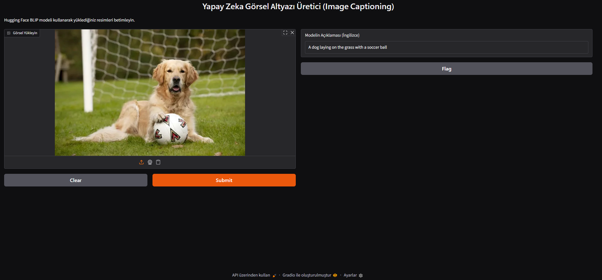
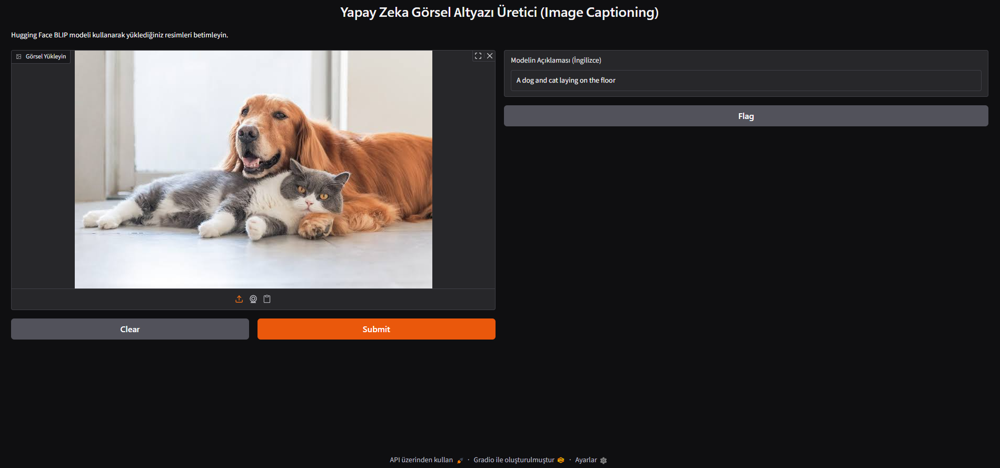

# 🚀 Pre-trained Models (Hazır Modeller)


Bu depo, yapay zeka ve derin öğrenme ekosistemindeki güçlü **Hazır Modellerin (Pre-trained Models)** kullanımını göstermek amacıyla hazırlanmıştır. İçerisinde iki temel Computer Vision (Bilgisayarlı Görü) projesi barındırır:

1. **Hugging Face BLIP Modeli ile Görüntü Altyazılama (Image Captioning)**
2. **Ultralytics YOLO ile Gerçek Zamanlı Nesne Tespiti (Object Detection)**

---

## 📑 İçindekiler
- [Proje 1: Görüntü Altyazılama (Image Captioning)](#proje-1-görüntü-altyazılama-image-captioning)
  - [Örnek Çıktılar (Görseller)](#örnek-çıktılar)
- [Proje 2: Gerçek Zamanlı Nesne Tespiti (YOLO)](#proje-2-gerçek-zamanlı-nesne-tespiti-yolo)
- [Kurulum & Gereksinimler](#kurulum--gereksinimler)
- [Proje Klasör Yapısı](#proje-klasör-yapısı)
- [Lisans](#lisans)

---

## 🖼️ Proje 1: Görüntü Altyazılama (Image Captioning)

**Dosya:** `image_captioning_blip.py`

Bu uygulama, **Salesforce/blip-image-captioning-base** modelini kullanarak yüklenen herhangi bir görseli analiz eder ve içeriğini anlatan doğru, akıcı İngilizce açıklamalar üretir. **Gradio** kütüphanesi kullanılarak interaktif ve kullanıcı dostu bir web arayüzü tasarlanmıştır.

### 🌟 Özellikler & Model Bilgileri
- **Kullanılan Model:** [Salesforce/blip-image-captioning-base](https://huggingface.co/Salesforce/blip-image-captioning-base)
- **Model Boyutu:** Yaklaşık **990 MB** *(İlk çalıştırmada Hugging Face Hub üzerinden otomatik olarak indirilir ve önbelleğe alınır).*
- **Yüksek Başarı:** Hugging Face'in popüler BLIP (Bootstrapping Language-Image Pre-training) mimarisi.
- **Kullanıcı Dostu Arayüz:** Gradio ile sürükle-bırak destekli web arayüzü.
- **Hızlı Çıkarım (Inference):** CPU ve GPU üzerinde optimize edilmiş işlem adımları ile saniyeler içinde sonuç.

### 📸 Örnek Çıktılar

Aşağıdaki örneklerde modelin görselleri nasıl yorumladığını görebilirsiniz:

#### Görsel 1

> **Model Çıktısı:** A dog laying on the grass with a soccer ball
> *(Çimlerde futbol topu ile yatan köpek)*

#### Görsel 2

> **Model Çıktısı:** A dog and cat laying on the floor
> *(Yerde yatan bir köpek ve kedi)*

### 🚀 Kullanım
Terminalinizde aşağıdaki komutu çalıştırın:
```bash
python image_captioning_blip.py
```
Uygulama başladığında, terminalde beliren `http://127.0.0.1:7860` adresini tarayıcınızda açarak arayüze erişebilirsiniz.

---

## 🎥 Proje 2: Gerçek Zamanlı Nesne Tespiti (YOLO)

**Dosya:** `object_detection_yolo.py`

Webcam üzerinden gelen canlı video akışını analiz ederek gerçek zamanlı nesne tespiti (Object Detection) yapar. **Ultralytics YOLO** (COCO veri seti ile eğitilmiş 80 sınıf) kullanılarak nesneler bounding box (sınırlayıcı kutu) ile ekranda işaretlenir ve tespit edilen nesneler eş zamanlı olarak konsola yazdırılır.

### 🌟 Özellikler
- **Gerçek Zamanlı İşleme:** Kamera akışı üzerinden anlık analiz.
- **Akıllı Loglama:** Sadece ekrandaki nesneler değiştiğinde konsola çıktı verir.
- **Esnek Konfigürasyon:** Güven eşiği (confidence threshold) ve kamera indeksi kolayca değiştirilebilir.

### 🚀 Kullanım
```bash
python object_detection_yolo.py
```
Kameranız açılacak ve tespitler başlayacaktır. Pencere açıkken **`q`** tuşuna basarak uygulamadan güvenle çıkabilirsiniz.

---

## ⚙️ Kurulum & Gereksinimler

Bu projeyi kendi ortamınızda çalıştırmak için aşağıdaki adımları izleyin:

### 1. Depoyu Klonlayın
```bash
git clone https://github.com/ensarakbas77/Derin-Ogrenme-100-Gunluk-Kamp.git
cd "Derin-Ogrenme-100-Gunluk-Kamp/Computer Vision/PretrainedModels"
```

### 2. Sanal Ortam (Virtual Environment) Oluşturun
```bash
python -m venv .venv

# Windows için:
.venv\Scripts\activate

# macOS / Linux için:
source .venv/bin/activate
```

### 3. Bağımlılıkları Yükleyin
Proje için gerekli olan tüm kütüphaneleri yüklemek için:
```bash
pip install -r requirements.txt
```
**`requirements.txt` İçeriği:**
```text
ultralytics
opencv-python
transformers
torch
torchvision
pillow
requests
gradio
```

---

## 📂 Proje Klasör Yapısı

Projeyi düzenli tutmak adına aşağıdaki yapı kullanılmıştır:

```text
PretrainedModels/
├── images/                     # Örnek görsel çıktıları
│   ├── caption1.png
│   └── caption2.png
├── image_captioning_blip.py    # Görüntü altyazılama ana scripti
├── object_detection_yolo.py    # YOLO nesne tespiti ana scripti
├── requirements.txt            # Python kütüphane gereksinimleri
├── .gitignore                  # Git takip dışı dosyalar
└── README.md                   # Proje dokümantasyonu (Bu dosya)
```

---
