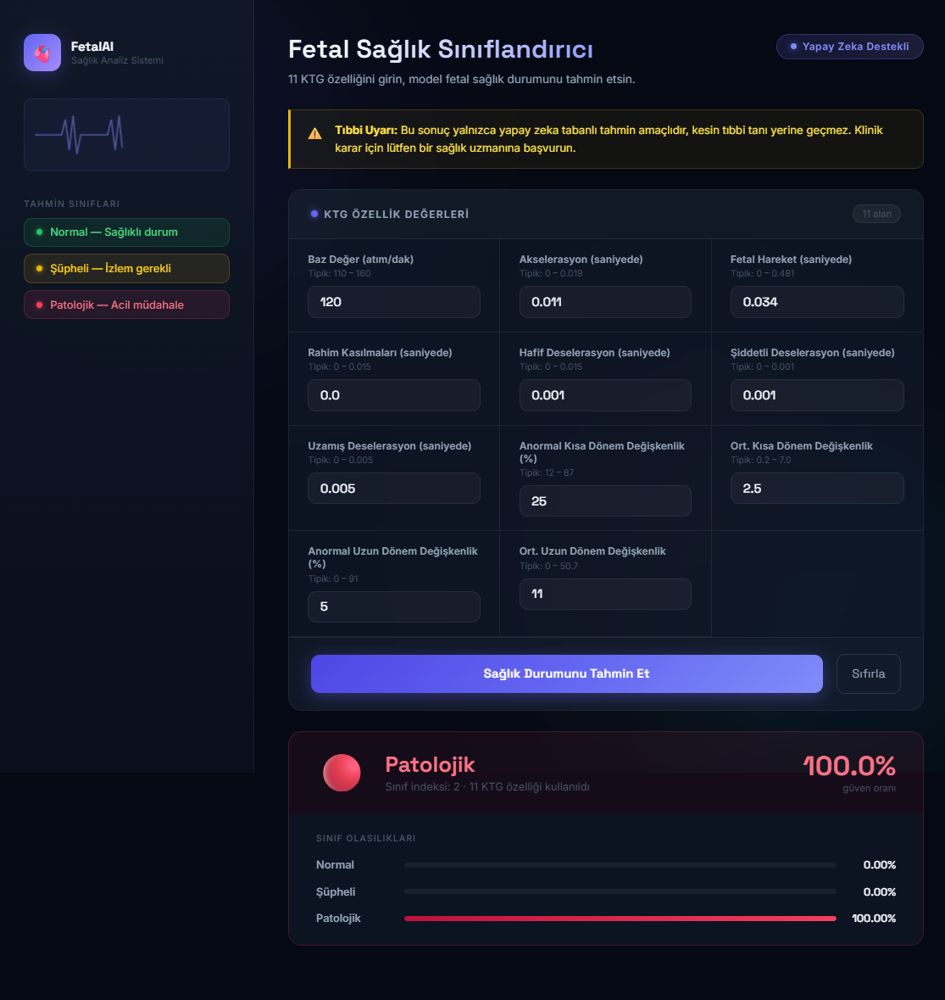

# Fetal Health Classifier

PyTorch ile eğitilmiş bir yapay sinir ağı (ANN) modelini FastAPI üzerinden sunarak 11 CTG (kardiyotokografi) özelliğinden fetal sağlık sınıflandırması yapan yapay zeka destekli web uygulaması.

---

## Uygulama Görüntüsü



---

## Tahmin Sınıfları

| İndeks | Etiket       | Açıklama                                    |
|--------|--------------|---------------------------------------------|
| 0      | Normal       | Endişe verici bir durum yok — sağlıklı      |
| 1      | Suspect      | Daha fazla izleme gerektirir                |
| 2      | Pathological | Acil klinik müdahale gerekebilir            |

---

## Proje Klasör Yapısı

```
FetalHealthClassifier/
├── app/
│   ├── main.py        # FastAPI uygulaması ve rotalar
│   ├── model.py       # PyTorch model mimarisi
│   ├── schemas.py     # Pydantic giriş/çıkış şemaları
│   └── predictor.py   # Çıkarım mantığı (model ve scaler tek seferinde yüklenir)
├── models/
│   ├── fetal_health_classification.pth   # Eğitilmiş model ağırlıkları
│   └── scaler.pkl                        # Eğitilmiş StandardScaler
├── static/
│   ├── style.css      # Arayüz stilleri
│   └── script.js      # Frontend mantığı (fetch, sonuç gösterimi)
├── templates/
│   └── index.html     # Jinja2 HTML şablonu
├── image.png          # Uygulama ekran görüntüsü
├── requirements.txt
└── README.md
```

---

## Kurulum

### 1. Sanal ortam oluştur ve etkinleştir

```bash
python -m venv .venv
# Windows
.venv\Scripts\activate
```

### 2. Bağımlılıkları yükle

```bash
pip install -r requirements.txt
```

### 3. Model dosyalarını kontrol et

Aşağıdaki dosyaların `models/` klasöründe bulunduğundan emin ol:

```
models/fetal_health_classification.pth
models/scaler.pkl
```

### 4. Sunucuyu çalıştır

```bash
uvicorn app.main:app --reload
```

Ardından tarayıcıda şu adresi aç: [http://localhost:8000](http://localhost:8000)

---

## API Referansı

### `POST /predict`

**İstek gövdesi (JSON):**

```json
{
  "baseline_value": 120.0,
  "accelerations": 0.003,
  "fetal_movement": 0.0,
  "uterine_contractions": 0.004,
  "light_decelerations": 0.0,
  "severe_decelerations": 0.0,
  "prolongued_decelerations": 0.0,
  "abnormal_short_term_variability": 25.0,
  "mean_value_of_short_term_variability": 1.5,
  "percentage_of_time_with_abnormal_long_term_variability": 5.0,
  "mean_value_of_long_term_variability": 10.0
}
```

**Yanıt (JSON):**

```json
{
  "predicted_class_index": 0,
  "predicted_label": "Normal",
  "probabilities_percent": {
    "Normal": 99.9993,
    "Suspect": 0.0007,
    "Pathological": 0.0
  }
}
```

Etkileşimli API dökümantasyonu: [http://localhost:8000/docs](http://localhost:8000/docs)

---

## Model Detayları

| Özellik        | Değer                           |
|----------------|---------------------------------|
| Kütüphane      | PyTorch                         |
| Mimari         | ANN (11 → 20 → 20 → 3)          |
| Aktivasyon     | ReLU                            |
| Kayıp Fonk.    | CrossEntropyLoss                |
| Optimizer      | Adam (lr=0.01)                  |
| Epoch          | 120                             |
| Ön İşleme      | StandardScaler (train'e fit edildi) |
| Sınıflar       | Normal / Suspect / Pathological |

---

> **Uyarı:** Bu uygulama yalnızca yapay zeka tabanlı tahmin amaçlıdır, kesin tıbbi tanı yerine geçmez.
