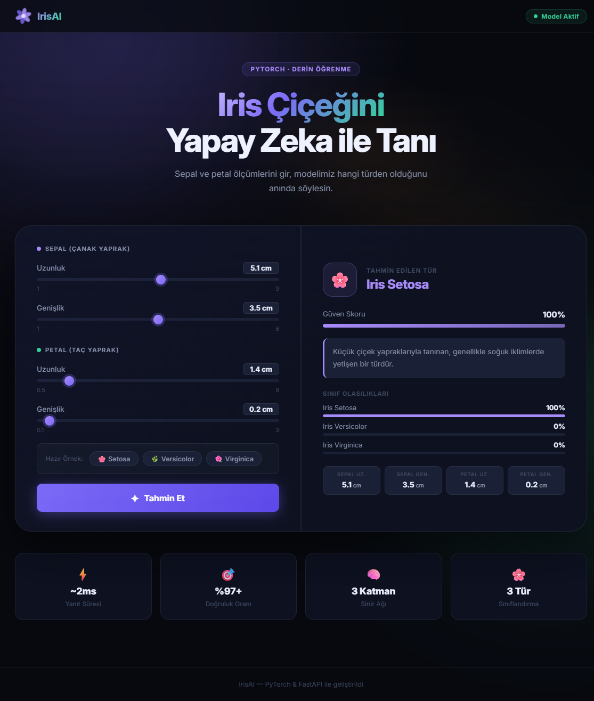

# 🌸 IrisAI — Iris Çiçeği Sınıflandırma Web Uygulaması

> **PyTorch** ile eğitilmiş derin öğrenme modelini **FastAPI** üzerinden servis eden, modern bir web arayüzüne sahip tam yığın (full-stack) bir makine öğrenmesi deployment projesi.



---

## ✨ Özellikler

- 🧠 **Derin Öğrenme Modeli** — PyTorch ile 3 katmanlı tam bağlantılı sinir ağı
- ⚡ **Gerçek Zamanlı Tahmin** — FastAPI REST API (~2 ms yanıt süresi)
- 🎨 **Modern Arayüz** — Saf HTML/CSS/JS, dark mode, glassmorphism, animasyonlar
- 🎚️ **Slider Tabanlı Giriş** — Kullanıcı dostu ölçüm arayüzü
- 🌿 **3 Sınıf** — Iris Setosa, Iris Versicolor, Iris Virginica
- 📊 **Olasılık Görselleştirmesi** — Tüm sınıfların güven skorları

---

## 🏗️ Proje Yapısı

```
IrisClassifierDeepLearningDeployment/
│
├── main.py                        # FastAPI uygulaması & API endpoint'leri
├── model.py                       # IrisClassifier sinir ağı tanımı
├── iris_classification_model.pth  # Eğitilmiş model ağırlıkları
├── requirements.txt               # Python bağımlılıkları
│
└── static/
    ├── index.html                 # Ana sayfa
    ├── style.css                  # Stiller (dark mode, animasyonlar)
    └── script.js                  # Slider mantığı, fetch API, sonuç render
```

---

## 🧠 Model Mimarisi

`model.py` dosyasında tanımlı `IrisClassifier` sınıfı:

```
Girdi (4 özellik)
    ↓
Linear(4 → 16) + ReLU
    ↓
Linear(16 → 16) + ReLU
    ↓
Linear(16 → 3)
    ↓
Çıktı (3 sınıf ham logit)
```

| Parametre        | Değer             |
|-----------------|-------------------|
| Giriş boyutu    | 4 (sepal/petal)   |
| Gizli katman    | 16 nöron × 2      |
| Çıkış boyutu    | 3 sınıf           |
| Aktivasyon      | ReLU              |
| Kayıp fonk.     | CrossEntropyLoss  |
| Optimizer       | Adam (lr=0.01)    |
| Epoch sayısı    | 200               |

---

## 🌺 Sınıflar

| Sınıf            | Renk    | Açıklama                                               |
|-----------------|---------|--------------------------------------------------------|
| Iris Setosa     | Mor     | Küçük çiçek yapraklarıyla tanınan soğuk iklim türü    |
| Iris Versicolor | Yeşil   | Mavi-mor çiçekli, Kuzey Amerika'ya özgü tür           |
| Iris Virginica  | Turuncu | Büyük çiçekli, güneydoğu ABD'ye özgü tür             |

---

## 🚀 Kurulum & Çalıştırma

### 1. Bağımlılıkları Kur

```bash
# Sanal ortamı aktive et
.venv\Scripts\Activate.ps1        # Windows PowerShell
# veya
source .venv/bin/activate          # Linux / macOS

# Bağımlılıkları yükle
pip install -r requirements.txt
```

### 2. Sunucuyu Başlat

```bash
uvicorn main:app --reload --host 127.0.0.1 --port 8000
```

> **`--reload`** bayrağı geliştirme sırasında dosya değişikliklerinde sunucuyu otomatik yeniden başlatır.

### 3. Tarayıcıda Aç

```
http://127.0.0.1:8000
```

---

## 📡 API Referansı

### `POST /predict`

Iris çiçeği ölçümlerini alıp tür tahmini döndürür.

**İstek Gövdesi (JSON):**
```json
{
  "sepal_length": 5.1,
  "sepal_width":  3.5,
  "petal_length": 1.4,
  "petal_width":  0.2
}
```

**Yanıt:**
```json
{
  "predicted_class": "Iris Setosa",
  "confidence": 99.97,
  "probabilities": {
    "Iris Setosa":     99.97,
    "Iris Versicolor":  0.02,
    "Iris Virginica":   0.01
  },
  "description": "Küçük çiçek yapraklarıyla tanınan...",
  "color": "#a78bfa"
}
```

### `GET /health`

Sunucu sağlık kontrolü.

```json
{ "status": "ok", "model": "IrisClassifier", "version": "1.0.0" }
```

### `GET /docs`

FastAPI'nin otomatik Swagger UI dokümantasyonu.

---

## 📦 Bağımlılıklar

```
fastapi==0.109.1
uvicorn==0.27.0
torch==2.10
pydantic
python-multipart==0.0.19
numpy
```

---

## 🛠️ Geliştirici Notları

- Model ağırlıkları `iris_classification_model.pth` dosyasında `state_dict` formatında saklanmaktadır.
- `torch.load()` CPU modunda yükleme yapar; GPU gerekmez.
- Tüm frontend static dosyaları `/static` path'inden sunulur.
- Swagger UI için `http://127.0.0.1:8000/docs` adresini ziyaret edebilirsin.

---

<div align="center">
  <sub>IrisAI — PyTorch & FastAPI ile geliştirildi 🌸</sub>
</div>
